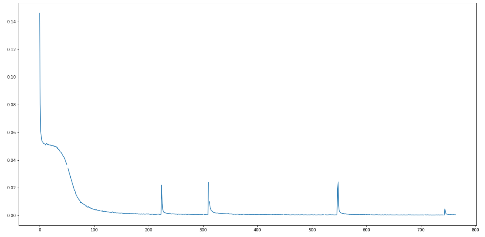
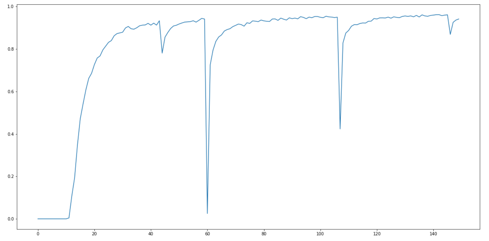
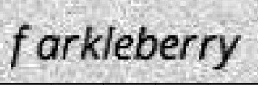
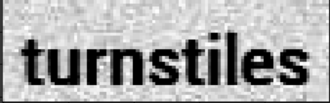

## Source Paper

This code is the implementation of paper - 

**An End-to-End Trainable Neural Network for Image-based Sequence Recognition and Its Application to Scene Text Recognition** 

[Link to Paper](https://arxiv.org/abs/1507.05717)

--------
## Input Data

Input data for this code is auto generated using [trdg](https://github.com/Belval/TextRecognitionDataGenerator). It generates random text images with added noise. 

This tool was used to generate 200000 train images. Out of which 4000 images were used for validation. 

--------
## Network Details

Network consists of 
* CNN (values mentioned are specific to this code)
  * Takes input image of fixed height. In this code, height is 32
  * Applies convolution on the image. For the final convolution feature, height is 1. 
  * The convolution features in the final layer (512* 1 * 26) are clubbed together to form tensor of size (512 * 26)
  * This tensor is further split columnwise.
  * Finally, we have 26 tensors of size (1 * 512). If the image is split columnwise into 26 columns, then each tensor represents the feature for this column
* RNN
  * Features extracted from previous steps are feed to RNN layer.
  * Bidirectional LSTM is used for prediction
* CTC Loss
  * Since the ground truth label size is not fixed for traingin example, notmal cross entropy loss cannot be used
  * Details about CTC loss - [Sequence Modeling With CTC ](https://distill.pub/2017/ctc/)

--------
## Training
Trained the network on google colab GPU. 
for batch_size of 64 , training for each iteration took ~ 0.05 secs compared to 5 secs on CPU. 

In the file training_log.txt, for lines ex:

``a ~ ~ ~ ~ n ~ ~ ~ a ~ l l o ~ ~ g ~ ~ i ~ c ~ ~ ~ ~ ||||| analogic ``

The left one is predicted label. The one on right is ground truth. 

--------
## Loss
Average training loss per 20 iterations is calculated, here is the graph, 

--------
## Validation Accuracy
After every 400 iterations, the network is validated on 4000 validation images. Here is the accuracy graph. 

``The sudden increase in loss in this graph while training, is I belive due to the backword hook applied on network``

There are some labels (ground truth) in the data with length greater than 26. When this label goes as input in the network, it creates inf loss corresponding to that label. Before gradient update, the inf gradients are set to 0 manually. This causes network distortion. 

Since word level comparison (not character level) is done for calculating accuracy, even slight distortion in network can result into higher decrease in accuracy. This explains the sudden huge validation accuracy decrease.

--------
## Saved Models
Added model for epoch_5_iteration_1000 in the ``saved_models`` folder. This is not the optimized model. 

--------
## Demo Images

Input Image | Predictions
------------ | -------------
 | farkleberry
 | turnstiles

